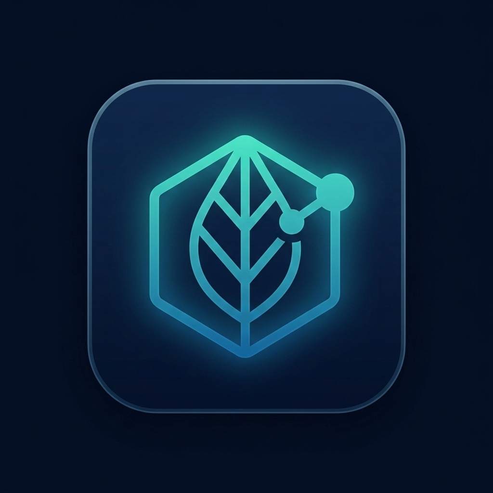

# Aushnexa

**AI-powered multilingual clinical decision-support platform for detecting interactions between Ayurvedic herbs and allopathic medicines.**

<p align="center">
  
</p>

## Overview

Aushnexa uses a biomedical knowledge graph (Neo4j) to detect, explain, and grade the severity of potential interactions between:

- Prescription medications (allopathic drugs)
- Ayurvedic herbs and formulations
- Active phytochemicals
- Supplements

The platform answers questions like:
> *"Can I take Ashwagandha with Metformin and Amlodipine?"*

## Tech Stack

| Layer | Technology |
|-------|-----------|
| Frontend | React 18 + Vite + Tailwind CSS |
| Backend | FastAPI (Python 3.11+) |
| Knowledge Graph | Neo4j 5.x |
| Relational DB | PostgreSQL 15 |
| Cache | Redis 7 |
| AI Explanations | Groq API (Llama 3.3 70B) |
| Translation | Sarvam AI |
| Deployment | Docker Compose + Nginx |

## Quick Start

### Prerequisites

- Docker & Docker Compose
- Node.js 18+ (for frontend dev)
- Python 3.11+ (for backend dev)

### 1. Clone and configure

```bash
cp .env.example .env
# Edit .env with your API keys:
# - GROQ_API_KEY
# - SARVAM_API_KEY
```

### 2. Start Docker services

```bash
docker-compose up -d neo4j postgres redis
```

### 3. Start backend

```bash
cd backend
pip install -r requirements.txt
uvicorn app.main:app --reload --port 8000
```

### 4. Start frontend

```bash
cd frontend  # (project root for Vite)
npm install
npm run dev
```

### 5. Load seed data

```bash
python data_pipeline/loaders/neo4j_loader.py
python data_pipeline/scripts/init_db.py
```

Open http://localhost:3000

## Architecture

```
React Frontend (Vite + Tailwind)
        ↓ REST API
FastAPI Backend
        ↓
  ┌─────┼─────────┐
  ↓     ↓         ↓
Neo4j  PostgreSQL  Redis
(Graph) (Users)   (Cache)
  ↓
Groq API → Explanation
Sarvam AI → Translation
```

## API Endpoints

| Method | Endpoint | Description |
|--------|----------|-------------|
| POST | `/api/v1/check-interactions` | Check drug-herb interactions |
| GET | `/api/v1/normalize?q=` | Normalize entity name |
| POST | `/api/v1/auth/register` | Register user |
| POST | `/api/v1/auth/login` | Login (returns JWT) |
| GET | `/api/v1/auth/profile` | User profile |
| GET | `/api/v1/history` | Query history (auth required) |
| POST | `/api/v1/translate` | Translate text (Sarvam AI) |
| GET | `/health` | Health check |

## Project Structure

```
aushnexa/
├── src/                    # React frontend
│   ├── pages/              # Page components
│   ├── components/         # Reusable UI components
│   ├── hooks/              # Custom React hooks
│   ├── services/           # API service layer
│   ├── store/              # Zustand state management
│   ├── utils/              # Helpers and formatters
│   └── constants/          # App constants
├── backend/
│   ├── app/
│   │   ├── api/v1/         # FastAPI route handlers
│   │   ├── core/           # Security, exceptions
│   │   ├── services/       # Business logic
│   │   ├── graph/          # Neo4j queries
│   │   ├── db/             # PostgreSQL models
│   │   ├── schemas/        # Pydantic models
│   │   └── cache/          # Redis caching
│   └── tests/              # Backend tests
├── data_pipeline/
│   ├── seed_data/          # JSON seed files
│   ├── loaders/            # Data import scripts
│   └── scripts/            # DB initialization
├── nginx/                  # Reverse proxy config
└── docker-compose.yml      # Infrastructure
```

## Supported Languages

English, Hindi, Tamil, Telugu, Marathi, Kannada, Bengali

## License

Proprietary — All rights reserved.

## Disclaimer

Aushnexa provides information only and does not replace professional medical advice. Always consult your doctor or pharmacist before combining medications or herbal supplements.
